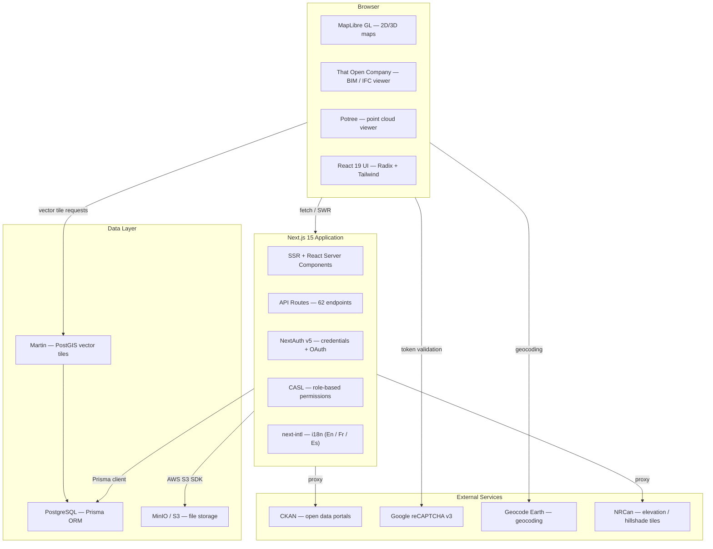

# Architecture Overview

How CDT's frontend, backend, and data layers connect to form a collaborative digital twin platform.

## Overview

CDT is a full-stack Next.js 15 application that combines three specialized visualization engines — maps, BIM/IFC models, and point clouds — with a REST API layer and a PostgreSQL + MinIO storage backend. The entire application, from server-side rendering to API routes, lives in a single Next.js deployment, which keeps infrastructure simple while still supporting a rich, interactive browser experience. Authentication, role-based permissions, and multi-tenant organization support are built in at the framework level.

## High-Level Architecture

## Frontend

The browser layer is built on **Next.js 15** with **React 19**, using the App Router for both server-side rendering and client-side navigation. **Turbopack** drives the development server, making incremental rebuilds fast. Styling is handled by **Tailwind CSS** with **Radix UI** primitives — unstyled, accessible components that CDT's design system builds on top of.

### Visualization engines

CDT ships three distinct viewers, each optimized for a different type of spatial data:

- **MapLibre GL** (`maplibre-gl`) — renders 2D and 3D maps, vector tiles from Martin, and satellite/basemap layers. Includes measurement tools via `maplibre-gl-measures` and geospatial operations via Turf.js.
- **That Open Company** (`@thatopen/components`) — a WebGL-based BIM viewer that parses and displays IFC files (the open standard for building models) directly in the browser using `web-ifc`. Supports fragment-based streaming for large models.
- **Potree** (`potree-cdt`) — renders massive point cloud datasets (LiDAR scans and photogrammetry) using a level-of-detail octree structure so only visible geometry is loaded.

### State management

Application state is organized into React Context providers, composed together at the app root. Each provider owns a focused slice of state with its own reducer:

| Provider | Owns |
|---|---|
| `AppConfigProvider` | Organization config, feature flags, map defaults |
| `BimProvider` | IFC viewer engine state, loaded fragments |
| `MapProvider` | MapLibre map instance, active layers, viewport |
| `MenusProvider` | Sidebar and toolbar menu state |
| `ToolsProvider` | Active tool selection per viewer |
| `ContentProvider` | Current content panel and view mode |
| `DatasetsProvider` | CKAN / open-data dataset state |
| `FilesProvider` | File upload queue and metadata |
| `BuildingsProvider` | Selected building and property cache |
| `PointCloudProvider` | Potree viewer instance, loaded scenes |
| `PermissionsProvider` | CASL ability instance for the current user |

Data fetching uses **SWR** for cache-aware client-side requests and a thin HTTP adapter that normalizes all calls through `/api`. Charts are rendered with **Recharts**.

### Internationalization

CDT ships with English, French, and Spanish translations via **next-intl**, including locale-aware routing. The locale is derived from the URL segment and organization configuration.

## Backend

CDT's backend lives entirely inside Next.js API routes — there is no separate server process. The `src/app/api/` directory contains **62 route handlers** organized by domain:

| Domain | Routes |
|---|---|
| `buildings` | CRUD, file attachments, bulk import |
| `sites` | Site management and hierarchy |
| `files` | Upload, download, presigned URLs |
| `sensors` / `sensorTypes` | IoT sensor data and type registry |
| `infrastructure` | Infrastructure asset records |
| `organizations` | Tenant management and config |
| `users` | User accounts, roles, password reset |
| `comments` | Threaded comments on entities |
| `datasets` | Dataset metadata and records |
| `openDataPortals` | Open data portal registry |
| `ckanProxy` / `opendatasoftProxy` | External data source proxies |
| `dataAnalysis` | Aggregation and reporting endpoints |
| `auth` / `[...auth]` | NextAuth session and callback handlers |

### Authentication

**NextAuth v5** handles authentication with a credentials provider (email + bcrypt password) and Google OAuth. Sessions are JWT-based with a Prisma adapter that persists `Account` records to PostgreSQL. Email verification and password-reset flows use **Nodemailer** (SMTP).

### Permissions

**CASL** (an attribute-based access control library) enforces permissions on both the server and client. The `PermissionsProvider` builds an `Ability` instance from the current user's `Role` at session time. API routes check this ability before mutating data, and the frontend uses it to conditionally render controls.

## Data Layer

### PostgreSQL via Prisma

All structured data lives in **PostgreSQL**. **Prisma ORM** provides a type-safe query client and handles migrations. The core models are:

- **Organization** — top-level tenant; owns users, buildings, sites, sensors, files, and roles
- **User** — belongs to an organization, assigned a role; can have linked OAuth accounts
- **Role** — named permission set scoped to an organization
- **Account** — OAuth provider tokens, linked to a user (NextAuth pattern)
- **Building** — the primary asset entity; holds rich attribute data (address, geometry, energy, funding, compliance) and belongs to one or more organizations via `BuildingOnOrganizations`
- **Site** — a geographic grouping of buildings; belongs to an organization
- **File** — metadata record for any uploaded binary; references a MinIO object key
- **Sensor** — IoT sensor linked to a building or organization
- **SensorType** — sensor category and unit definitions
- **Infrastructure** — non-building infrastructure assets
- **Comment** — threaded annotation on buildings or organizations
- **OpenDataPortal** — registered CKAN or Opendatasoft portal endpoints

Buildings carry PostGIS-compatible coordinates (`buildingLatitude`, `buildingLongitude`, `featureId`) and are served as vector tiles by Martin.

### Object storage (MinIO / S3)

Binary assets — IFC building models, Potree point cloud tiles, PDFs, images — are stored in **MinIO** (S3-compatible). The API issues presigned URLs so the browser uploads and downloads directly to storage, keeping large files out of the Next.js process. The `@aws-sdk/client-s3` and `@aws-sdk/s3-request-presigner` packages handle all S3 operations.

### Martin (vector tiles)

**Martin** is a separate PostGIS tile server that reads spatial data directly from PostgreSQL and serves it as Mapbox Vector Tiles. MapLibre consumes these tiles to render building footprints and site boundaries on the map without transferring full GeoJSON payloads.

## External Integrations

| Service | Purpose |
|---|---|
| **CKAN** | Open data portal API — proxied through `/api/ckanProxy` and `/api/opendatasoftProxy` to avoid CORS and hide credentials |
| **Google reCAPTCHA v3** | Bot protection on public-facing forms (sign-up, contact) |
| **Geocode Earth** | Forward and reverse geocoding for address search (`NEXT_PUBLIC_GEOCODE_EARTH_API_KEY`) |
| **NRCan elevation services** | Canadian elevation and hillshade raster tiles, proxied via rewrites in `next.config.ts` |
| **Google OAuth** | Optional social sign-in via NextAuth (`AUTH_GOOGLE_ID` / `AUTH_GOOGLE_SECRET`) |

## Next Steps

- [Frontend deep dive](../architecture/frontend) — component structure, viewer engines, state patterns
- [Backend & API reference](../architecture/backend-and-api) — route conventions, auth flow, permission model
- [Data layer](../architecture/data-layer) — schema design, migrations, file storage, Martin configuration
